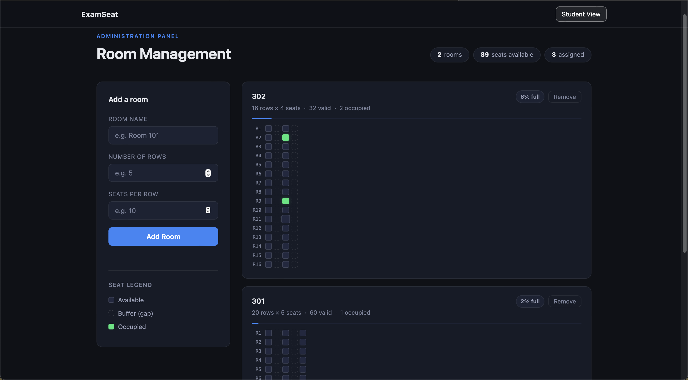
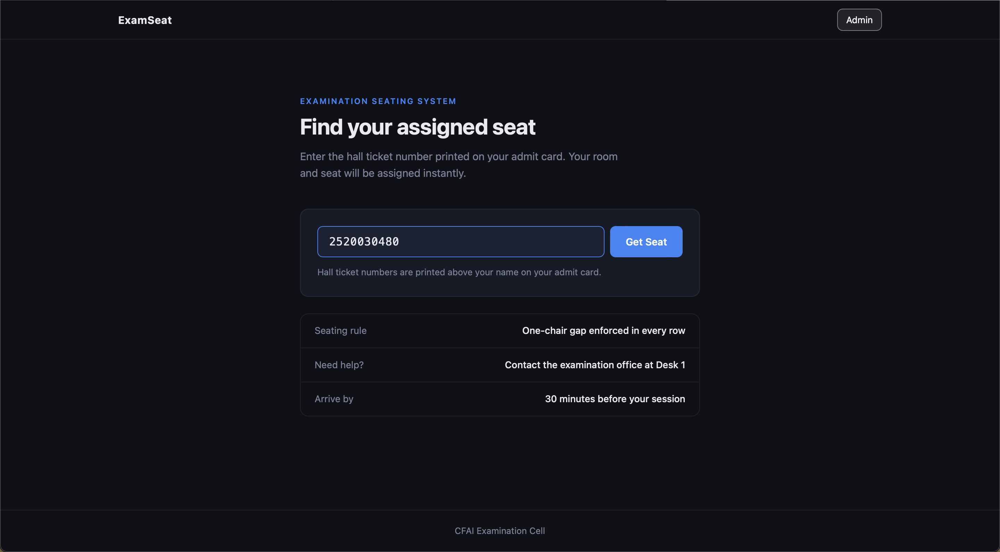

# ExamSeat 🎓

> Automated university examination seating — assign rooms and seats instantly, with a live admin dashboard.



---

## The Problem

Every exam season, university examination offices manually assign seats — a slow, error-prone process that causes confusion, last-minute changes, and crowding at entry points. Students waste time searching for their seat. Invigilators deal with seating disputes.

ExamSeat automates this entirely.

---

## What it does

### Student Side (`/`)
A student enters their hall ticket number and instantly gets an assigned room and seat. If they submit the same ID again, they see the same seat — no duplicate assignments.

### Admin Side (`/admin`)
The examination office can:
- Add rooms by entering a name, number of rows, and seats per row
- View a live visual grid of every room showing available, buffer, and occupied seats
- Hover over any occupied seat to see which student is sitting there
- Delete rooms if needed
- Monitor real-time stats — total rooms, seats available, students assigned

---

## The smart seating rule

Every **even-numbered seat** is automatically marked as a buffer gap — the one-chair cheating prevention rule used in Indian university exams. Only odd-numbered seats are assignable. This is enforced automatically when a room is created — no manual configuration needed.

---

## Why this is interesting (technically)

- **Random assignment from a global pool** — instead of filling one room at a time, the system picks from all valid unoccupied seats across every room simultaneously, so students are spread evenly
- **Idempotent assignments** — submitting the same hall ticket twice always returns the same seat, never a new one
- **Live grid refresh** — the admin page polls `/api/stats` and `/api/rooms` every 5 seconds via `fetch()`, so the grid updates in real time without page reloads
- **In-memory data store** — everything runs in Python dictionaries. No database setup required

---

## Tech Stack

| Layer | Technology |
|---|---|
| Backend | Python + Flask |
| Routing | Flask routes + REST API endpoints |
| Frontend | HTML5, CSS3, Vanilla JavaScript |
| Templating | Jinja2 (Flask built-in) |
| Live updates | Browser Fetch API (polling every 5s) |
| Seat assignment | `random.choice()` from Python standard library |
| Data storage | In-memory Python dictionaries (no database) |

---

## Project Structure

```
ExamSeat/
├── app.py                 # Flask backend — all routes and business logic
├── static/
│   └── style.css          # Full dark theme with CSS custom properties
└── templates/
    ├── index.html         # Student view
    └── admin.html         # Admin dashboard with live seat grid
```

---

## Running locally

```bash
# Install Flask
pip install flask

# Run the app
python app.py
```

Then open `http://localhost:5000` for the student view and `http://localhost:5000/admin` for the admin panel.

---

## Screenshots

### Student View


### Admin Dashboard


---

## Roadmap

- [ ] Persistent storage with SQLite or PostgreSQL
- [ ] CSV export of all seat assignments
- [ ] Login authentication for admin panel
- [ ] QR code generation per student assignment
- [ ] Deploy on Railway or Render

---

## What I learned

- Building a full-stack web app with a real backend for the first time
- Designing for two completely different user types (student vs admin) in the same system
- Thinking through edge cases — duplicate submissions, full rooms, buffer gaps
- How REST APIs work — Flask routes serving JSON to a vanilla JS frontend

---

*Built by [Rikhil Siripurapu](https://github.com/rikhil-33) — KL University, CSE AI/ML · Batch of 2029*
